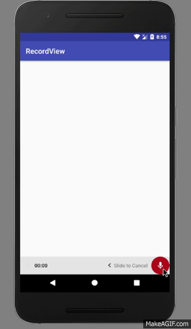

# RecordView
a Simple Audio Recorder View with hold to Record Button and Swipe to Cancel


## Demo
<p align="center">
  
</p>


## Install
```gradle
dependencies {
    compile 'com.devlomi.record-view:record-view:1.0.0beta'
}
```


## Usage

### XML

```xml
   <com.devlomi.record_view.RecordView
        android:id="@+id/record_view"
        android:layout_width="match_parent"
        android:layout_height="wrap_content"
        android:layout_alignParentBottom="true"
        android:background="#e4e4e4" />
```
### Configure XML
//Optional change Record Button Color Animation 
* app:record_btn_transition_background="@drawable/transition_drawable"

### Java

```java

private RecordView recordView;

recordView = (recordView) findViewById(R.id.record_view);
```

Handling States

```java
recordView.setOnRecordListener(new OnRecordListener() {
            @Override
            public void onStart() {
                //Start Recording..
                Log.d("RecordView", "onStart");
            }

            @Override
            public void onCancel() {
                //On Swipe To Cancel
                Log.d("RecordView", "onCancel");

            }

            @Override
            public void onFinish(long recordTime) {
                //Stop Recording..
                String time = getHumanTimeText(recordTime);
                Log.d("RecordView", "onFinish");

                Log.d("RecordTime", time);
            }

            @Override
            public void onLessThanSecond() {
              //When the record time is less than One Second
                Log.d("RecordView", "onLessThanSecond");
            }
        });

```

Change Swipe To Cancel Bounds (when the 'Slide To Cancel' Text View get before Counter)

```java
recordView.setCancelBounds(130);
```

### Some Customization

```java
        recordView.setSmallMicColor(Color.parseColor("#c2185b"));

        recordView.setRecordButtonColor(Color.parseColor("#ffffff"));

        recordView.setRecordButtonTransitionBackground(R.drawable.transition_drawable);

        recordView.setSlideToCancelText("TEXT");

        //disable Sounds
        recordView.setSoundEnabled(false);

        //prevent recording under one Second (it's false by default)
        recordView.setLessThanSecondAllowed(false);
    
        //set Custom sounds onRecord 
        //you can pass 0 if you don't want to play sound in certain state
        recordView.setCustomSounds(R.raw.record_start,R.raw.record_finished,0);


```

**Note**: for changing RecordButton Color Animation you must provide a **Transition Drawable** instead of a **Normal Drawable** and you can set it from Java or XML


### Thanks/Credits
- [NetoDevel](https://github.com/NetoDevel) for some inspiration and some code in his lib [audio-recorder-button](https://github.com/safetysystemtechnology/audio-recorder-button) 
- [wnafee](https://github.com/wnafee) for his lib [vector-compat](https://github.com/wnafee/vector-compat) which helped me to make AnimatedVectorDrawable Compaitable in older APIs
- [alexjlockwood](https://github.com/alexjlockwood) for making this Awesome tool  [ShapeShifter](https://shapeshifter.design/) which helped me to animate vectors easily

