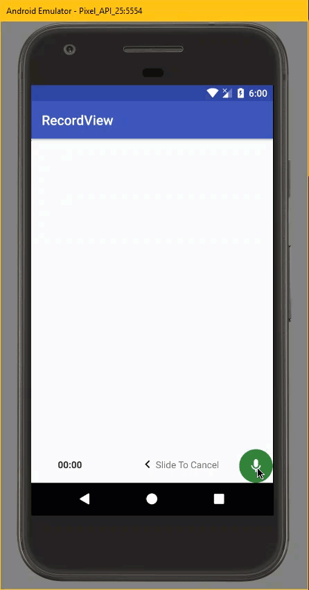

[](https://android-arsenal.com/details/1/6259)
 [  ](https://bintray.com/devlomi/maven/RecordView/_latestVersion)

# RecordView


A Simple Audio Recorder View with hold to Record Button and Swipe to Cancel

Forked from [3llomi/RecordView](https://github.com/3llomi/RecordView)

## Added Features

- Added RTL Support
- Added Methods to set minimum and maximum recording duration boundaries
- Migrated to AndroidX

## Demo
<p align="center">
  
</p>


## Usage

### XML

```xml

<?xml version="1.0" encoding="utf-8"?>
<RelativeLayout
    xmlns:android="http://schemas.android.com/apk/res/android"
    xmlns:app="http://schemas.android.com/apk/res-auto"
    xmlns:tools="http://schemas.android.com/tools"
    android:id="@+id/parent_layout"
    android:layout_width="match_parent"
    android:layout_height="match_parent">


    <com.devlomi.record_view.RecordView
        android:id="@+id/record_view"
        android:layout_width="match_parent"
        android:layout_height="wrap_content"
        android:layout_alignParentBottom="true"
        android:layout_toStartOf="@id/record_button"
        app:slide_to_cancel_arrow="@drawable/recv_ic_arrow"
        app:slide_to_cancel_arrow_color="#000000"
        app:slide_to_cancel_bounds="10dp"
        app:slide_to_cancel_margin_end="10dp"
        app:slide_to_cancel_text="Slide To Cancel"
        app:counter_time_color="#ff0000"
        />

    <com.devlomi.record_view.RecordButton
        android:id="@+id/record_button"
        android:layout_width="wrap_content"
        android:layout_height="wrap_content"
        android:layout_alignParentBottom="true"
        android:layout_alignParentEnd="true"
        android:background="@drawable/recv_bg_mic"
        android:scaleType="centerInside"
        app:mic_icon="@drawable/recv_ic_mic_white" />


</RelativeLayout>


```


### Java

```java

        RecordView recordView = findViewById(R.id.record_view);
        RecordButton recordButton = findViewById(R.id.record_button);

        //IMPORTANT
        recordButton.setRecordView(recordView);

```

### Handling States

```java

    recordView.setOnRecordListener(new OnRecordActionListener() {
            @Override
            public void onStart() {
                Toast.makeText(MainActivity.this, "OnStart", Toast.LENGTH_SHORT).show();
                Log.d("RecordView", "onStart");
            }

            @Override
            public void onCancel() {
                Toast.makeText(MainActivity.this, "onCancel", Toast.LENGTH_SHORT).show();
                Log.d("RecordView", "onCancel");

            }

            @Override
            public void onMaxDurationReached() {
                Toast.makeText(MainActivity.this, "onMaxDurationReached", Toast.LENGTH_SHORT).show();
                Log.d("RecordView", "onMaxDurationReached");
            }

            @Override
            public void onFinish(long recordTime) {
                String time = getHumanTimeText(recordTime);
                Toast.makeText(MainActivity.this, "onFinish - Recorded Time : " + time, Toast.LENGTH_SHORT).show();
                Log.d("RecordView", "onFinish");
                Log.d("RecordTime", time);
            }

            @Override
            public void onLessThanMinimumDuration() {
                Toast.makeText(MainActivity.this, "onLessThanMinimumDuration", Toast.LENGTH_SHORT).show();
                Log.d("RecordView", "onLessThanMinimumDuration");
            }
        });

```

### Handle Clicks Independently for Record Button ( can be used in case of requiring permissions or send button)
```java

    recordButton.setRecordActionListeningEnabled(false);

    //  RecordActionListeningEnabled must be false ,otherwise onClick will not be called

        recordButton.setOnRecordButtonClickListener(v -> {
            Toast.makeText(MainActivity.this, "onRecordButtonClick", Toast.LENGTH_SHORT).show();
            Log.d("RecordButton", "onRecordButtonClick");
        });

```

### Listen for Basket Animation End

```java

   recordView.setOnBasketAnimationEndListener(() -> {
               Toast.makeText(MainActivity.this, "onBasketAnimationEnd", Toast.LENGTH_SHORT).show();
               Log.d("RecordView", "onBasketAnimationEnd");
           });

```


Change Swipe To Cancel Bounds (when the 'Slide To Cancel' Text View get before Counter).
default is 8dp

```java
    recordView.setCancelBounds(8);//dp
```

### Some Customization

```java
        recordView.setSmallMicColor(Color.parseColor("#c2185b"));

        recordView.setSlideToCancelText("TEXT");

        //disable Sounds
        recordView.setSoundEnabled(false);

        //prevent recording under one Second
        recordView.setMinRecordDurationInSeconds(1);

        //prevent recording under one Second and have maximum bound of five seconds
        //you can pass 0 as maximum boundary to have endless limit (the default)
        recordView.setRecordDurationBoundsInSeconds(1, 5);
    
        //set Custom sounds onRecord 
        //you can pass 0 if you don't want to play sound in certain state
        recordView.setCustomSounds(R.raw.record_start,R.raw.record_finished,0);
        
        //change slide To Cancel Text Color
        recordView.setSlideToCancelTextColor(Color.parseColor("#ff0000"));

        //change slide To Cancel Arrow Color
        recordView.setSlideToCancelArrowColor(Color.parseColor("#ff0000"));

        //change Counter Time (Chronometer) color
        recordView.setCounterTimeColor(Color.parseColor("#ff0000"));

```
